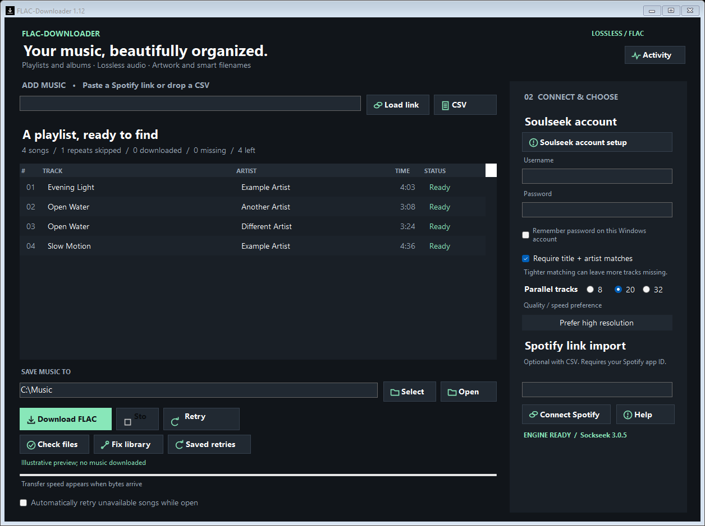

# FLAC-Downloader

> **Made using AI.** This application was designed and implemented with extensive assistance from **OpenAI Codex**, guided by human requests and testing. AI generated much of the code, tests, documentation, and interface work. See [AI disclosure](AI-DISCLOSURE.md).

A portable Windows desktop app for finding FLAC audio on Soulseek from a Spotify playlist, album, or CSV tracklist.



## Download and use

Download the [Windows x64 portable ZIP](https://github.com/Eternal-Wisdom/FLAC-Downloader/releases/latest/download/flac-downloader-1.14.0-windows-x64.zip) from the [Releases page](https://github.com/Eternal-Wisdom/FLAC-Downloader/releases), extract the entire folder, and open **FLAC-Downloader.exe**. Windows 10/11 x64 and .NET Framework 4.8 are required. The executable is currently unsigned.

1. Enter your own Soulseek account. New to Soulseek? Follow the [account setup guide](docs/SOULSEEK-ACCOUNT.md). If another Soulseek client is using it, disconnect that client or use a separate account.
2. Import a CSV, or configure your own Spotify developer Client ID and connect to load a playlist or album link.
3. Choose a destination and quality/speed preference, then select **Download FLAC**.

Spotify supplies metadata; audio is obtained from Soulseek peers. Availability, correctness, and speed depend on those peers. This app does not convert lossy files to FLAC or guarantee that a FLAC originated from a lossless source. Use it for music you are entitled to download and share. This project is not affiliated with Spotify, Soulseek, Nicotine+, or Sockseek.

## Features

- Playlist and album links, CSV import, Unicode search alternatives, and selected-song downloads.
- FLAC-only filtering; Fast FLAC, Balanced, and higher-resolution preference profiles.
- 8, 20, or 32 concurrent jobs. Jobs include searching and queued work, not just active transfers.
- Conservative duplicate recording detection and cross-collection reuse.
- Song-title filenames; artist names are added when different songs share a title.
- Missing cover lookup, reversible metadata edits, and FLAC header checks.
- Saved unavailable tracks with retries starting after 15 minutes and backing off to six hours. Launching or closing the app does not start background downloads.
- Resizable dark interface, status colors, action icons, and an Activity window.

Formerly named Playlist FLAC. Existing settings and library metadata remain compatible.

Version 1.12 adds track/source details, right-click file actions, layout recovery, and stricter download failure handling. See the [code review and recommendation decisions](docs/CODE-REVIEW.md) and [validation results and limits](docs/VALIDATION.md).

## Clean folder layout

The portable download contains only the app, engine, guide, documentation, and license. It creates `state/` for private settings and caches. Source, test results, update archives, credentials, and music are excluded from release downloads.

```text
FLAC-Downloader/
  FLAC-Downloader.exe
  START HERE.txt
  LICENSE
  docs/
  engine/
```

A music collection keeps playable content separate from tracking data:

```text
Collection/
  playlist/                 # Your FLAC songs
  playlist.m3u8             # Open this in your music player
  .playlist-flac/           # Index, imported tracklist, and reports
  .playlist-flac-recovery/  # Preserved undo data
```

Hidden `.search`, `.incoming`, and lock files can also remain for interrupted-job recovery. Older artwork/duplicate recovery directories can contain absolute paths and are retained in their original location. Hidden items remain visible if Windows Explorer's Show hidden items is enabled. No recovery copies are silently deleted. See [folder and recovery details](docs/FOLDERS.md).

## Build and test

Windows PowerShell 5.1 and the .NET Framework compiler are sufficient; no Visual Studio installation is required.

```powershell
powershell -NoProfile -ExecutionPolicy Bypass -File scripts/Build.ps1
powershell -NoProfile -ExecutionPolicy Bypass -File scripts/Test.ps1
powershell -NoProfile -ExecutionPolicy Bypass -File scripts/Package.ps1
```

Build downloads the pinned Sockseek 3.0.5 Windows engine and checks the ZIP and executable hashes. Tests run in a separate executable against the built app and emit JUnit evidence in `build/test-results.xml` (suite counts, timestamps, revision and hashes). Test code is excluded from the portable app. Tests use synthetic local data and mock downloads; no account or network transfers are needed after engine setup. Source for the bundled engine is included in `third-party/` and in the portable release. See [release instructions](docs/RELEASING.md).

## Privacy and limitations

Settings and retry lists stay in `state/` beside the app. Remembered Soulseek passwords are protected for the current Windows account using DPAPI. Spotify access tokens remain in memory. Soulseek credentials are temporarily written to a restricted engine configuration and removed after use. Search queries are sent to Soulseek; artwork lookup may contact Spotify, MusicBrainz, and the Cover Art Archive. Do not upload your state, music, debug logs, or real tracklists in bug reports.

The app is Windows-only. Spotify API access is subject to your developer app's current permissions. Albums import as individual tracks. Reported speed is approximate byte-progress telemetry. FLAC checks inspect headers, not provenance or every audio frame. No automatic updater or always-running background service is included.

## License and credits

FLAC-Downloader is released under **AGPL-3.0-only**. The independently launched [Sockseek](https://github.com/fiso64/sockseek) engine has its own upstream AGPL license and source. See [third-party notices](THIRD-PARTY-NOTICES.md). Contributions are welcome; please read [CONTRIBUTING.md](CONTRIBUTING.md).

Version 1.13 review decisions are documented in [the external-review follow-up](docs/REVIEW-1122.md).
